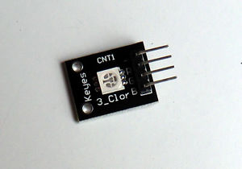
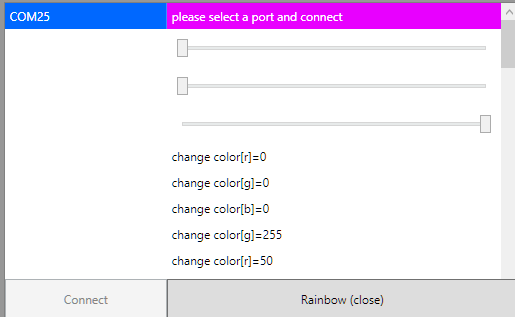

Arduino RGB Controller
======================

Very simple to do. First use Arduino IDE software to upload `arduino-rgb-controller.ino` file.
Build the `arduino-rgb-controller-wpf` WPF project with visual studio. 

Prepare hardware
------------------

Connect `-(module)` to `GND(arduino)`
Connect `R(module)` to `11(arduino)`
Connect `G(module)` to `10(arduino)`
Connect `B(module)` to `9(arduino)`

Prepare software
-------------------
Open ino file with arduino ide software. Select correct com port and device. Upload it. 

Communications
----------------
Arduino serial expects 4 byte of data.

`N` - first char of number
`N` - second char of number
`N` - third char of number
`X` - which led

If you want to turn on the red light; you must send `255r', If you want to turn off it just send '000r', You can use these too: `100r`, `050g`, `999b`. You can send all of them onces too: `100r050g999b`

> Make sure that you are sending 4 bytes for each command. if you send '00r' or '0r' this cause padding problem and your other signals ignored. for example;
> `120r` _ok_
> `100b` _ok_
> `10b` _oopss ignored_
> `100b` _ignored_
> `0` _fixed error_
> `100b` _ok_

Here some pictures and video.

